# Street Clash

`Street Clash` は、ブラウザで `index.html` を開くだけで遊べる 1 人用 3D 格闘ゲームです。  
CPU と 1 対 1 で戦い、パンチ、強攻撃、ガード、ジャンプ、3D 移動、必殺技を使ってラウンド勝利を目指します。



## ゲーム内容

- 3D ステージ上で CPU と対戦する格闘ゲームです。
- 左右移動だけでなく、奥行き方向にも移動できます。
- 体力、制限時間、ラウンド勝敗、必殺技ゲージがあります。
- ガード、しゃがみ、ジャンプ、リングアウト、崖復帰があります。
- 必殺技を出すと、カメラがキャラクターに寄り、光の演出とスローモーションが入ります。
- キャラクターはブロック状のボクセル風 3D モデルです。
- 勝敗数、最高連勝、難易度、音量、キー設定はブラウザの `localStorage` に保存されます。

## 起動方法

HTTP サーバーやインストール作業は不要です。

1. このリポジトリをダウンロードまたは clone します。
2. `index.html` を Chrome / Edge などのブラウザで開きます。
3. タイトル画面で `Play` を押すと対戦が始まります。

直接開く例:

```text
file:///C:/Users/waseda/Desktop/work/K20/ex10/index.html
```

## 操作方法

| 操作 | キー |
| --- | --- |
| Uppercut / Dragon Dance | `U` |
| Storm Blade: Sky Cleaver | `U` |
| Storm Blade: Sonic Slash | `I` |
| Storm Blade: Limit Wave | `L` |
| 左右移動 | `A` / `D` |
| 奥行き移動 | `Q` / `E` |
| ジャンプ | `W` |
| ガード / しゃがみ | `S` |
| 弱攻撃 | `J` |
| 強攻撃 | `K` |
| 必殺技 / ゲージ最大時の超必殺技 | `L` |
| カメラ切り替え | `C` |
| カメラ回転 | `←` / `→` |
| カメラ高さ調整 | `↑` / `↓` |
| 一時停止 | `Escape` |

## 戦い方のコツ

- ジャンプすると下段攻撃を避けられます。
- しゃがむと通常の中段攻撃を避けやすくなります。
- 相手の攻撃方向を向いて `S` を押すとガードできます。
- ステージ外へ落ちそうになったら、移動やジャンプで端へ戻ると崖復帰できます。
- ゲージがたまった状態で `L` を押すと、より派手で強力な超必殺技が出ます。

## ファイル構成

```text
.
├── index.html
├── src/
│   ├── styles.css
│   ├── main.js
│   ├── game.js
│   ├── fighter.js
│   ├── input.js
│   └── storage.js
├── vendor/
│   └── three.min.js
└── assets/
    ├── .gitkeep
    └── readme-animation.svg
```

## 技術メモ

- 描画はローカル配置した Three.js を使っています。
- CDN や外部素材には依存していません。
- JavaScript はビルドなしで読み込まれるため、`index.html` を直接開いて動作します。
- 保存データはブラウザ内の `localStorage` に保持されます。

## 開発ワークフロー

チケット対応は `WORKFLOW.md` の手順で進めます。  
各 issue ごとに、実装、検証、別セッションレビュー、修正、公開、issue クローズを繰り返します。
